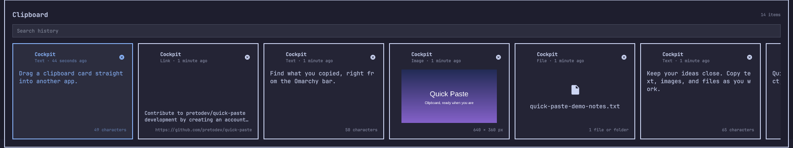

# Quick Paste

Quick Paste is a visual clipboard history plugin for the Omarchy 4.x bar. It
opens a bottom panel with horizontally scrollable cards for text, images, and
files. The interface follows the system locale in Portuguese, English, and
Spanish; other locales use English.



Open the panel from the bar, search your recent clipboard items, and click or
press Enter to paste. Cards can also be dragged into other apps. Each card
shows its source app, age, and content details when available.

Copied HTTP(S) links can show an Open Graph preview when the destination
provides one. Preview retrieval is best effort, uses short timeouts, and is
limited to one megabyte. The original URL remains the clipboard item and is
always what gets pasted.

Each new item records its source application and a relative age, plus its
Unicode character count, image dimensions, or file count. Existing Omarchy
clipboard history is imported on first run. Metadata unavailable in older
entries is shown as unknown. Source application detection is best effort
because Wayland does not expose clipboard ownership metadata.

## Install

Install Quick Paste from its Git repository with Omarchy's plugin manager:

```bash
omarchy plugin add https://github.com/pretodev/quick-paste.git --enable
make -C ~/.config/omarchy/plugins/quick-paste
install -m 0755 ~/.config/omarchy/plugins/quick-paste/build/qick-paste-clipboard-provider \
  ~/.config/omarchy/plugins/quick-paste/qick-paste-clipboard-provider
omarchy bar move quick-paste --section right --before omarchy.power
```

The first command installs and enables the plugin. The next two build and
install its multi-format Wayland clipboard provider, which the plugin uses to
preserve clipboard MIME types. The final command places the widget in the
right section before the power widget. Building requires `make`, `gcc`,
`pkg-config`, `wayland-scanner`, Wayland client headers, and the wlr-data-control
protocol. To update the plugin later, run:

```bash
omarchy plugin update quick-paste
make -C ~/.config/omarchy/plugins/quick-paste
install -m 0755 ~/.config/omarchy/plugins/quick-paste/build/qick-paste-clipboard-provider \
  ~/.config/omarchy/plugins/quick-paste/qick-paste-clipboard-provider
```

To remove the plugin, run:

```bash
omarchy plugin remove quick-paste
```

## Requirements

- Omarchy 4.x with the Quickshell-based shell
- Runtime commands: `wl-clipboard`, `wtype`, `jq`, `perl`, `python3`, `curl`,
  and `setpriv`
- `tensaku` for image editing
- Build tools for the clipboard provider: `make`, `gcc`, `pkg-config`,
  `wayland-scanner`, Wayland client headers, and the wlr-data-control protocol

## Usage

- Click the bar icon to open or close the panel.
- Type to search copied text, links, and file names, or click the search field.
  Results update as you type, and Enter pastes the first match. Escape closes
  the panel and clears the search for the next opening.
- Click a card once to select it; click it again to paste and close.
- Drag a card to another app to drop its text, copied files or folders, or an
  image file. The panel closes after the drag, including when you cancel it.
- Use Left/Right to select, Enter to paste with every original MIME type,
  Shift+Enter to paste only `text/plain`, and Escape to close.
- Press Delete to remove the selected card, or Shift+Delete to open the
  confirmation dialog for clearing the entire history. Open the selected
  card's context menu with the Menu key or Shift+F10.
- Use Ctrl+Enter to open a selected HTTP(S) link in the default browser. The
  same action appears first in the card's context menu.
- Right-click an image and choose **Open in Tensaku** (or its translation).
  Saving the edit creates a new history item and leaves the original image
  untouched.
- Copied files and folders appear together in one card. Click twice or press
  Enter to paste the original file selection. The context menu can open the
  files, reveal them in Files, or paste absolute paths or `~/` paths. Path
  actions paste one path per line; `~/` is available only when every item is
  inside the home directory. Use Ctrl+O to open, Ctrl+Shift+O to reveal,
  Ctrl+P to paste absolute paths, or Ctrl+Shift+P to paste `~/` paths.
- Scroll vertically or horizontally over the row to move through the history.

The plugin stores its enriched history at
`~/.local/state/omarchy/qick-paste-history.json` by default and captured
clipboard formats under `~/.local/state/omarchy/qick-paste-items/`. Images
without a filename extension receive a file for dragging under
`~/.local/state/omarchy/qick-paste-drag-images/`. Clipboard
content and saved history are never translated.

## Development

The plugin keeps Omarchy's entry files (`manifest.json` and `BarWidget.qml`)
at the repository root. The panel and its JavaScript modules are in `ui/`,
runtime helpers are in `scripts/`, and the source of the Wayland clipboard
provider is in `native/`. Tests live in `tests/`; generated build files stay
in `build/`. The local installer under `.codex/skills/install-qick-paste/`
copies only the runtime files and the compiled provider.

Validate the manifest, build the clipboard provider, and run the project checks
with:

```bash
make validate
```

## License

Quick Paste is available under the [MIT License](LICENSE).
